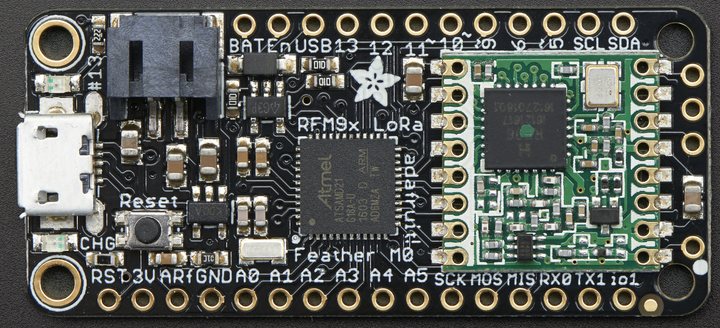

Motus Combo Test Tag
====================

The Motus Combo Test Tag acts as a Lotek and a CTT test tag for Motus stations.
The intended use is to carry in the pocket when servicing a station and be able to ensure that
everything works ends-to-end before leaving, as well as leaving a tag in the vicinity of a
station in order to get 24x7 monitoring of the station performance.

The test tag is built on the Adafruit
[Feather M0 with LoRa Radio Module](https://learn.adafruit.com/adafruit-feather-m0-radio-with-lora-radio-module/overview)
board, 433Mhz version, product id 3179.

Functionality
-------------

- after power-on or reset the board transmits a Lotek ID and a CTT ID every 5 seconds for 24 hours
- after the first 24 hours the board switches to a different Lotek ID (same CTT ID) and transmits
  a run of 7 transmissions approximately every hour

Programming
-----------

- download the firmware from this repo's releases, the file name should end in `.uf2`
- plug the board into your computer (windows, mac, linux), it should show up as a new drive
  like a USB flash stick would
- double press the reset button on the board, the LED should slowly pulse
- drag'n'drop the downloaded file onto the drive
- watch the LED: it should stay fully lit for ~3 seconds and then turn off, then blink
  every 5 seconds

Note: MacOS 13.0 (Ventura) [appears to have issues](https://blog.adafruit.com/2022/10/31/uploading-uf2-files-with-macos-13-0-ventura-apple-microbit_edu-raspberry_pi-circuitpython/)
  with this process, fixed in 13.1

Board specific notes
--------------------

- power via micro-USB connector or using a LiPO attached to the JST-PH connector on the board
- an attached LiPO is recharged when the board is plugged into USB
- try without antenna, it ought to work when at the station
- to add an antenna solder to the single hole on the short side of the board
- when using a LiPO to turn the battery on/off plug/unplug the LiPO, this is not super convenient
  but Adafruit claims that it works OK with the plug on its LiPO's (others use cheap versions that
  can be very difficult to get back out)

Power consumption
-----------------

- idle: 200uA
- TX: 200-300ms (depends on lotek tag) ~20mA avg -> about 4.4mAs or 16mJ @3.7V
- assuming 25s interval: about 180-200mAh per month
- more investigation needed...
