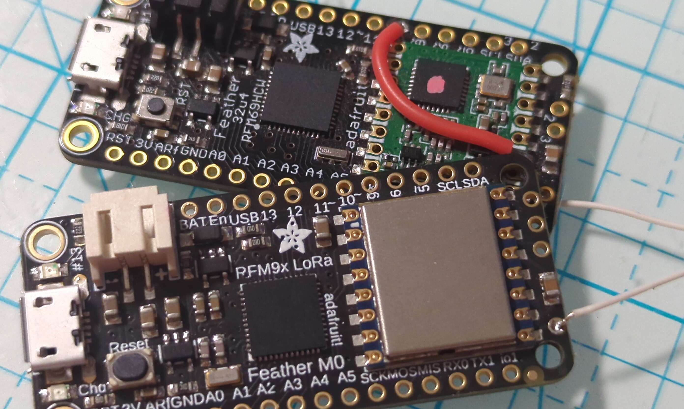

Motus test tags
===============

Code to turn off-the-shelf microcontroller+radio boards into test tags
for the Motus wildlife tracking system (https://motus.org).

The purpose of these test tags is to check out a station and to monitor station operation 24x7.
The test tags can be carried in a pocket with a small LiPO battery when performing maintenance on
a station to ensure that the receiver chain is working end-to-end before calling it good.
A test tag can also be left at the station to provide a 24x7 end-to-end verification that the
station is operating correctly.

These test tags should not be used for range tests because the output power is not the same as a
real tag and the physical form factor is not the same causing the RF emissions to not match those
of a real tag. It should be possible to perform relative comparisons, however, for example, comparing
two antennas at one station.

Speaking of output power... the pre-built firmware versions provided in this repo configure the
transmitter to a very low output power (0dBm to 2dBm, i.e., 1-1.6mW).
This power level is sufficient when the tag is in close proximity of the station and minimizes
the danger of interfering with something else, it is however a much lower power level than
actual tags.

Test tag versions
-----------------

There are currently two test tag versions available:

- [Lotek/CTT Combo Test Tag](/ComboTestTag) uses an Adafruit board with a modern
  radio that can support both the CTT UHF frequency and the Lotek VHF frequencies.
  If you are ordering boards to use as test tags this is the recommended one although it
  may cost slightly more than the next one.

- [CTT Test Tag](./CTTTestTag/) uses the same Adafruit board as the "CTT Motus Adapter" dongle
  for which CTT provides a receiver firmware, so you may have one of these already.
  The code here programs the board differently to act as a test tag.
  This board cannot transmit at the frequencies used by Lotek tags, hence it is CTT-only.

Firmware functionality
----------------------

The firmware functionality is designed to serve both during station maintenance and for
station monitoring.

- after power-on or reset the board transmits a Lotek ID and a CTT ID every 5 seconds for 12 hours
- after the first 12 hours the board transmits 15 times at 40 second interval every ~67 minutes

Battery
-------

The Adafruit boards have a connector for a LiPO battery, this allows the tags to be powered for
several hours without needing a USB connection, which can be handy when servicing a station:
just wrap some electrical tape around board and battery and stick into your pocket!
The board has a charger so plugging it in charges the LiPO.

The connector is a JST-PH but unfortunately its polarity is not standardized so if you purchase
a random LiPO with this connector be sure to triple-check the polarity!
(Hint: the negative/black wire connects to the pin closest to the USB connector.)
With fine tweezers it is not too difficult to pull the pins
out and swap them but do not short them 'cause you will get sparks and smoke!
For simplicity it's worth it to order an Adafruit LiPO...

Where to buy
------------

The boards can be purchased from many stores and distributors that carry Adafruit products as
well as from [Adafruit](https://www.adafruit.com) directly.
The README in each of the two tag variants has the exact product ID so you can be sure to get
the right version (the designations can be confusing).
Large electronics distributors and [Digi-Key](https://www.digikey.com) in particular carry these
boards and have worldwide reach (Digi-Key is happy to sell qty 1 to individuals).
Amazon is most likely a source as well, although the 433Mhz version may be less available.

Note that in a pinch the 915Mhz versions of these boards are 99% likely to work because the
RF filtering is only concerned about reducing the higher harmonics, so lower frequencies are
not attenuated. The performance may be a tad lower but the challenge here is more to get a
_weaker_ RF signal not a stronger one!

How-To
------

The Adafruit boards all have a Micro-USB connector and programming them is dead simple:
- download the test tag firmware
- plug the board into a laptop
- double-press the reset button on the board
- drag the downloaded file into the flash drive that appears
- enjoy the LED blinking for every transmission

That's about as easy as it gets... Details in the respective tag's README.

If you get a LiPO and intend to stick the tag into your pocket you should wrap some electrical
tape around the board+LiPO to make a handy protected little package.
Just keep the two connectors exposed so you can easy charge the LiPO and also unplug it when
you are not using it...

### Antenna

The Adafruit boards come without antenna and most likely you will not need one!
The goal is to just comfortably get detected by the receivers, so for CTT a signal strength
between -90 and -80dB is a good target and for Lotek a SNR between 12 and 24dB should do it.

One of the board's thru-holes allow an antenna wire to be soldered on and the back of the board
has a footprint to solder a u.Fl connector.
However, **no antenna is needed** unless the board is placed in a metal box or is otherwise shielded.
Without antenna the signal strength is about right when the board is in a plastic enclosure at the
base of the station antenna mast.
If the signal strength proves to be insufficient the simplest is to attach a short insulated wire
of a few cm in length or long enough to pass through a feed-through gland and stick a few cm
out of a metal enclosure.

Technically, the antenna should be about 16-17cm long for 434Mhz and about 42-45cm for 166Mhz
but this seems to produce a signal way stringer than needed.

Notes
-----

The code in this repository is provided under the MIT open source license, please see the
LICENSE file.

All the information used to encode the tag IDs was gathered through reverse engineering and the
author does not provide any guarantee that anything here is fit for any purpose.

Please keep in mind that by their nature test tags emit RF signals which are governed by FCC, ETSI,
or other regulatory agencies.
